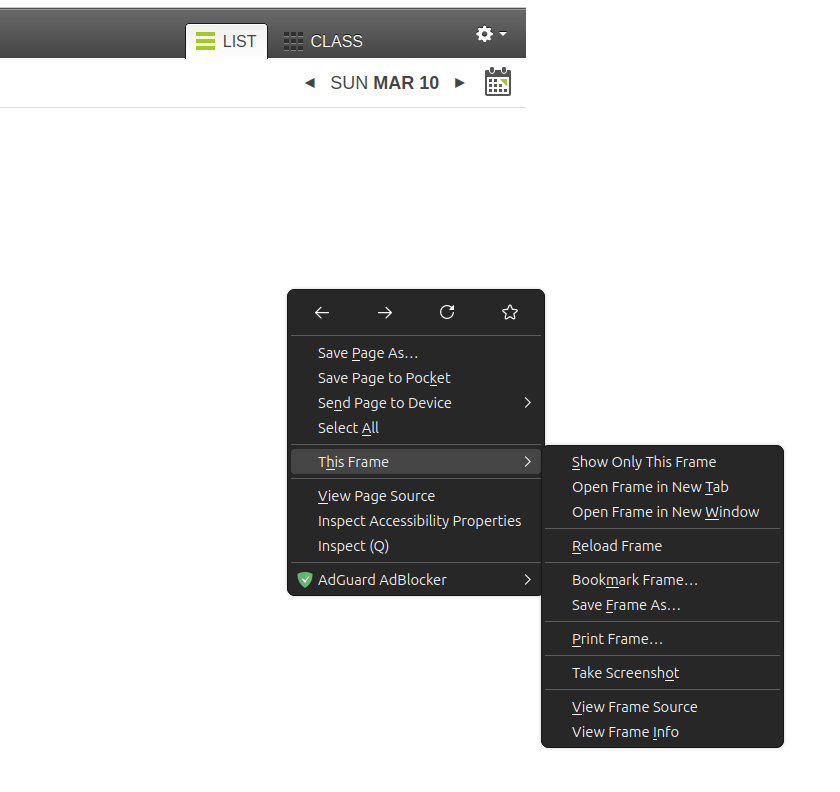

# A_Bot

A simple web extension to help you mark attendance on canvas from google meet meeting reports

### 🚨 Hold up 

Now i know you are really exited to try this but here are some caveats 

- This extension currently only works on firefox 
- It does not verify files (any .csv file will run )
- It does not check time or date in meeting
- It does not check or maintain state (i.e does not check whether attendance is already marked )
- running the app multiple times will cycle through the canvas attendance state


    - e.g
    - Running First time all Names in the csv are marked as present 
    - Running it for the second time they are marked as late 
    - Running it for the third time they are marked as absent
    - Running it for the fourth time will return them to the original state (un-marked)

    😃 *told you it was a feature* 


# Getting Started

## installation 

###  1. Clone or download this repository

*incase you forgot*

``` bash
git clone https://github.com/karusamuel/A_Bot.git
```
*incase its a zip download extract the file*

### 2. Installation
#### step 1
- Click at the hamburger icon at the top right 
- Then click on Add-ons and themes 


#### step 2
on the page that opens 
- click at the settings icon


#### step 3
on the opening dialog 
- click on install Add-on From File...


#### step 4

on the opening dialog
- navigate to the [clonedrepo]/web-ext-artifacts and select the .xpi file 


#### step 5
- click on add from the next dialog box 


#### step 6

- click on okay on the next dialog box


And thats it our extension is already installed 

#### Step 7

verify that the extension is installed


#### Thats it !


## usage 

- Open the attendance page on canvas and navigate to the correct date
- Right click on the student list frame and click on Show only This Frame

i.e

*Right Click -> This Frame -> Show Only This Frame* 



Navigate to the bottom of the opened page and you should see an input for your csv file and a mark attendance button 


- select the google meet attendance file  and click on the mark attendance button 

## just like that Attendance Marked


## Note 

- All affected student have a yellow hue on their name 
- Click on  mark attendance again to cycle attendance states 
- feel free to switch dates from this view

## Manual Marking 

- absence need to be manually marked

- Some student whose email names do not match those on canvas will still not be found and need to be marked manually check the manual marking sections to see


(any student without a yellow hue and is unmarked was not found on google meet report  i.e absent )

